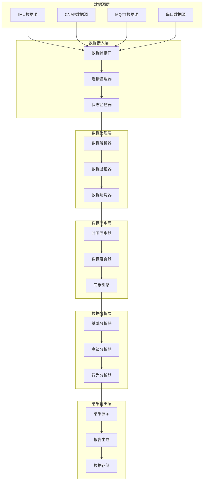
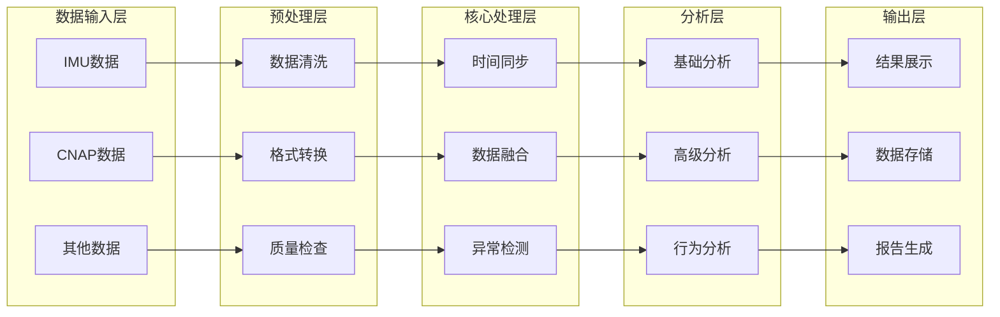
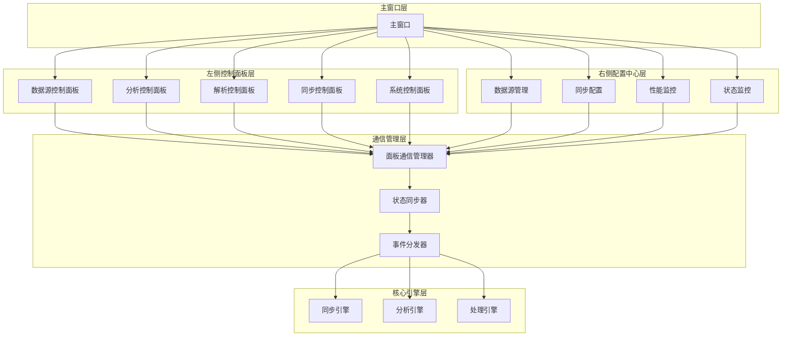
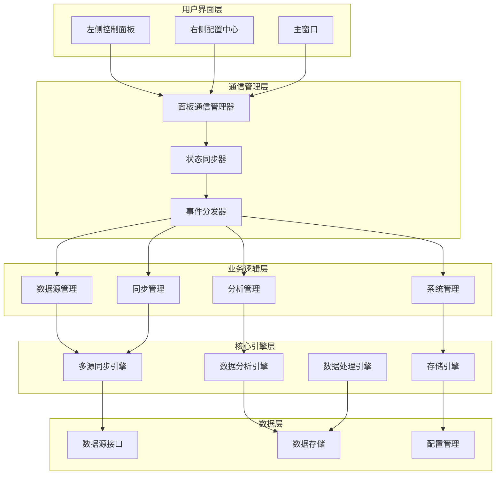
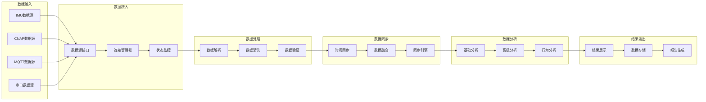
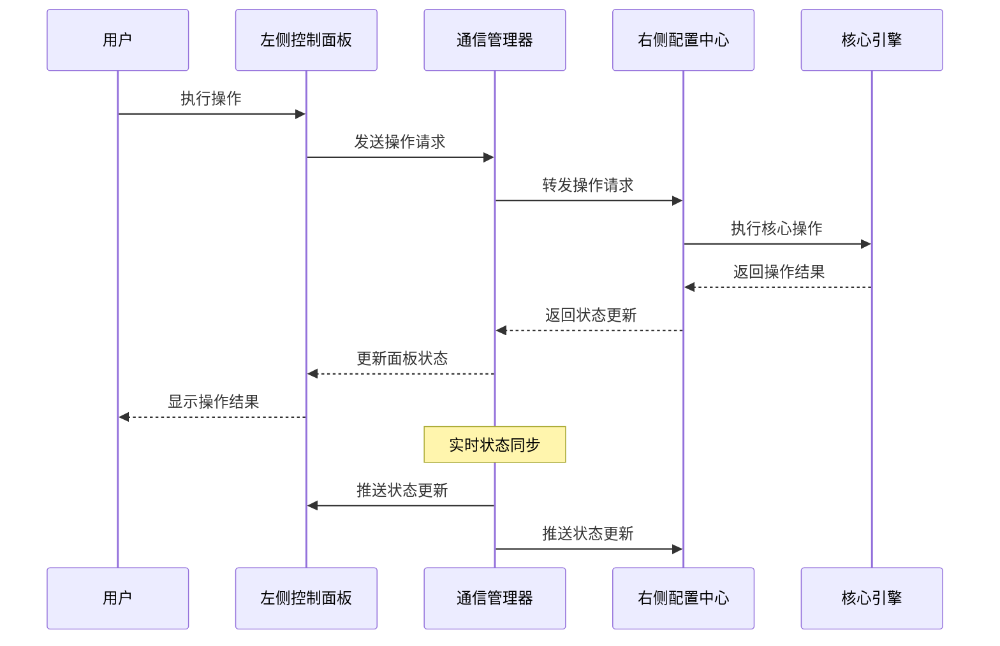

# 多源异构数据同步系统完整优化方案

## 目录
1. [系统现状分析](#系统现状分析)
2. [系统架构重构](#系统架构重构)
3. [数据流向优化](#数据流向优化)
4. [数据处理流程优化](#数据处理流程优化)
5. [UI交互优化](#ui交互优化)
6. [实施计划](#实施计划)
7. [技术架构图](#技术架构图)
8. [附加示意图描述](#附加示意图描述)

## 系统现状分析

### 1.1 系统架构现状

**当前系统架构特点：**
- **左侧控制面板**: 5个专业控制面板，负责业务驱动和用户交互
- **右侧配置中心**: 多源异构数据同步配置中心，负责数据源管理和同步配置
- **核心引擎**: 多源同步引擎、数据分析引擎、数据处理管道
- **数据流**: 从数据源接入到IMU数据高级分析的完整链路

**现有功能模块：**
- `DataSourceControlPanel` - 数据源概况展示
- `AnalysisControlPanel` - 基础/高级行为分析控制
- `ParsingControlPanel` - 数据解析控制
- `SyncControlPanel` - 多源同步控制
- `SystemControlPanel` - 系统控制
- `MultiSourceSyncConfigPanel` - 右侧配置中心

### 1.2 现存问题分析

#### 1.2.1 架构层面问题
- **左侧面板引用问题**: 复杂的向上查找机制，引用不稳定
- **左右面板通信问题**: 缺乏直接的通信机制，依赖复杂的引用查找
- **核心引擎集成问题**: 集成不完整，经常回退到模拟模式

#### 1.2.2 功能层面问题
- **数据源表格列索引不匹配**: 硬编码列索引，操作按钮创建失败
- **状态更新延迟**: 10秒延迟过长，用户体验差
- **错误处理不统一**: 缺乏统一的错误处理和恢复机制

#### 1.2.3 性能层面问题
- **数据同步效率低**: 缺乏批量处理和并行优化
- **内存管理不当**: 缺乏智能内存优化机制
- **实时性不足**: 状态更新和同步延迟过高

## 系统架构重构

### 2.1 整体架构重构

```
┌─────────────────────────────────────────────────────────────────┐
│                        系统架构重构                              │
├─────────────────────────────────────────────────────────────────┤
│  ┌─────────────────┐    ┌─────────────────┐    ┌─────────────┐ │
│  │   左侧控制面板   │    │   右侧配置中心   │    │  核心引擎   │ │
│  │                 │    │                 │    │             │ │
│  │ • 数据源控制    │◄──►│ • 数据源管理    │◄──►│ • 同步引擎  │ │
│  │ • 分析控制      │    │ • 同步配置      │    │ • 分析引擎  │ │
│  │ • 解析控制      │    │ • 性能监控      │    │ • 处理引擎  │ │
│  │ • 同步控制      │    │ • 状态监控      │    │ • 存储引擎  │ │
│  │ • 系统控制      │    │ • 配置管理      │    │             │ │
│  └─────────────────┘    └─────────────────┘    └─────────────┘ │
│           │                       │                   │         │
│           └───────────────────────┼───────────────────┘         │
│                                   │                             │
│  ┌─────────────────────────────────┼─────────────────────────────┐ │
│  │                   统一数据流管理器                            │ │
│  │  • 面板通信管理  • 状态同步管理  • 错误处理管理              │ │
│  │  • 数据路由管理  • 性能监控管理  • 恢复策略管理              │ │
│  └─────────────────────────────────────────────────────────────┘ │
└─────────────────────────────────────────────────────────────────┘
```

### 2.2 核心组件重构

#### 2.2.1 统一数据流管理器
```python
class UnifiedDataFlowManager:
    """统一数据流管理器 - 系统核心协调器"""
    
    def __init__(self):
        # 面板管理
        self.left_panels = {}
        self.right_panel = None
        
        # 核心引擎管理
        self.sync_engine = None
        self.analysis_engine = None
        self.processing_engine = None
        
        # 通信管理
        self.communication_bus = CommunicationBus()
        self.state_synchronizer = StateSynchronizer()
        self.error_handler = UnifiedErrorHandler()
        
        # 性能管理
        self.performance_monitor = PerformanceMonitor()
        self.memory_optimizer = MemoryOptimizer()
        
        # 初始化
        self._setup_communication_signals()
        self._setup_error_handling()
        self._setup_performance_monitoring()
    
    def register_left_panel(self, panel_name: str, panel_instance):
        """注册左侧面板"""
        self.left_panels[panel_name] = panel_instance
        self._setup_panel_signals(panel_name, panel_instance)
    
    def register_right_panel(self, panel_instance):
        """注册右侧配置中心"""
        self.right_panel = panel_instance
        self._setup_right_panel_signals(panel_instance)
    
    def register_core_engine(self, engine_name: str, engine_instance):
        """注册核心引擎"""
        if engine_name == 'sync_engine':
            self.sync_engine = engine_instance
        elif engine_name == 'analysis_engine':
            self.analysis_engine = engine_instance
        elif engine_name == 'processing_engine':
            self.processing_engine = engine_instance
```

#### 2.2.2 通信总线
```python
class CommunicationBus(QObject):
    """通信总线 - 面板间通信的核心"""
    
    # 定义系统级信号
    data_source_updated = Signal(str, dict)      # 数据源更新
    sync_status_changed = Signal(str, dict)      # 同步状态变化
    analysis_result_ready = Signal(str, dict)    # 分析结果就绪
    error_occurred = Signal(str, dict)           # 错误发生
    performance_updated = Signal(dict)            # 性能更新
    
    def __init__(self):
        super().__init__()
        self.subscribers = {}
        self.message_queue = Queue(maxsize=1000)
        self.message_processor = MessageProcessor(self.message_queue)
        self.message_processor.start()
    
    def publish(self, topic: str, message: dict):
        """发布消息到指定主题"""
        try:
            # 将消息加入队列
            self.message_queue.put({
                'topic': topic,
                'message': message,
                'timestamp': time.time()
            })
            
            # 直接发送给订阅者
            if topic in self.subscribers:
                for subscriber in self.subscribers[topic]:
                    try:
                        subscriber(message)
                    except Exception as e:
                        logger.error(f"消息发送失败: {e}")
                        
        except Exception as e:
            logger.error(f"发布消息失败: {e}")
    
    def subscribe(self, topic: str, callback):
        """订阅指定主题"""
        if topic not in self.subscribers:
            self.subscribers[topic] = []
        self.subscribers[topic].append(callback)
```

## 数据流向优化

### 3.1 数据流架构图



### 3.2 数据流优化策略

#### 3.2.1 并行数据处理
```python
class ParallelDataProcessor:
    """并行数据处理器"""
    
    def __init__(self, max_workers: int = 8):
        self.executor = ThreadPoolExecutor(max_workers=max_workers)
        self.processing_queue = Queue(maxsize=10000)
        self.result_queue = Queue(maxsize=10000)
        self.processing_tasks = {}
        
    async def process_data_stream(self, data_streams: Dict[str, Any]):
        """并行处理多个数据流"""
        try:
            # 创建并行处理任务
            tasks = []
            for source_id, data in data_streams.items():
                task = asyncio.create_task(
                    self._process_source_data(source_id, data)
                )
                tasks.append(task)
            
            # 等待所有任务完成
            results = await asyncio.gather(*tasks, return_exceptions=True)
            
            # 处理结果
            processed_data = {}
            for i, result in enumerate(results):
                source_id = list(data_streams.keys())[i]
                if isinstance(result, Exception):
                    logger.error(f"数据源 {source_id} 处理失败: {result}")
                    processed_data[source_id] = None
                else:
                    processed_data[source_id] = result
            
            return processed_data
            
        except Exception as e:
            logger.error(f"并行数据处理失败: {e}")
            return {}
    
    async def _process_source_data(self, source_id: str, data: Any):
        """处理单个数据源的数据"""
        try:
            # 数据预处理
            preprocessed_data = await self._preprocess_data(data)
            
            # 数据解析
            parsed_data = await self._parse_data(preprocessed_data)
            
            # 数据验证
            validated_data = await self._validate_data(parsed_data)
            
            return {
                'source_id': source_id,
                'data': validated_data,
                'timestamp': time.time(),
                'status': 'success'
            }
            
        except Exception as e:
            logger.error(f"数据源 {source_id} 处理失败: {e}")
            return {
                'source_id': source_id,
                'data': None,
                'timestamp': time.time(),
                'status': 'error',
                'error': str(e)
            }
```

#### 3.2.2 智能数据路由
```python
class IntelligentDataRouter:
    """智能数据路由器"""
    
    def __init__(self):
        self.routing_rules = {}
        self.performance_metrics = {}
        self.adaptive_routing = True
        
    def route_data(self, data: Dict[str, Any]) -> str:
        """智能路由数据到合适的处理器"""
        try:
            # 分析数据特征
            data_features = self._analyze_data_features(data)
            
            # 选择最佳路由
            best_route = self._select_best_route(data_features)
            
            # 更新性能指标
            self._update_performance_metrics(best_route, data_features)
            
            return best_route
            
        except Exception as e:
            logger.error(f"数据路由失败: {e}")
            return 'default_processor'
    
    def _analyze_data_features(self, data: Dict[str, Any]) -> Dict[str, Any]:
        """分析数据特征"""
        features = {
            'data_type': data.get('type', 'unknown'),
            'data_size': len(str(data)),
            'complexity': self._calculate_complexity(data),
            'priority': data.get('priority', 'normal'),
            'timestamp': data.get('timestamp', time.time())
        }
        return features
    
    def _select_best_route(self, features: Dict[str, Any]) -> str:
        """选择最佳路由"""
        # 基于数据特征和性能指标选择最佳处理器
        if features['data_type'] == 'imu':
            return 'imu_processor'
        elif features['data_type'] == 'cnap':
            return 'cnap_processor'
        elif features['complexity'] > 0.8:
            return 'advanced_processor'
        else:
            return 'standard_processor'
```

## 数据处理流程优化

### 4.1 数据处理架构图



### 4.2 数据处理优化策略

#### 4.2.1 智能数据清洗
```python
class IntelligentDataCleaner:
    """智能数据清洗器"""
    
    def __init__(self):
        self.cleaning_rules = {}
        self.quality_thresholds = {}
        self.cleaning_history = []
        
    def clean_data(self, data: Dict[str, Any]) -> Dict[str, Any]:
        """智能清洗数据"""
        try:
            # 应用清洗规则
            cleaned_data = self._apply_cleaning_rules(data)
            
            # 质量评估
            quality_score = self._assess_data_quality(cleaned_data)
            
            # 如果质量不达标，进行深度清洗
            if quality_score < self.quality_thresholds.get('min_quality', 0.8):
                cleaned_data = self._deep_clean_data(cleaned_data)
                quality_score = self._assess_data_quality(cleaned_data)
            
            # 记录清洗历史
            self._record_cleaning_history(data, cleaned_data, quality_score)
            
            return {
                'data': cleaned_data,
                'quality_score': quality_score,
                'cleaning_applied': True
            }
            
        except Exception as e:
            logger.error(f"数据清洗失败: {e}")
            return {
                'data': data,
                'quality_score': 0.0,
                'cleaning_applied': False,
                'error': str(e)
            }
    
    def _apply_cleaning_rules(self, data: Dict[str, Any]) -> Dict[str, Any]:
        """应用清洗规则"""
        cleaned_data = data.copy()
        
        # 移除异常值
        for key, value in cleaned_data.items():
            if isinstance(value, (int, float)):
                if self._is_outlier(value, key):
                    cleaned_data[key] = self._calculate_replacement_value(key, cleaned_data)
        
        # 填充缺失值
        cleaned_data = self._fill_missing_values(cleaned_data)
        
        # 数据标准化
        cleaned_data = self._normalize_data(cleaned_data)
        
        return cleaned_data
```

#### 4.2.2 自适应数据融合
```python
class AdaptiveDataFusion:
    """自适应数据融合器"""
    
    def __init__(self):
        self.fusion_algorithms = {
            'weighted_average': WeightedAverageFusion(),
            'kalman_filter': KalmanFilterFusion(),
            'neural_network': NeuralNetworkFusion(),
            'ensemble': EnsembleFusion()
        }
        self.algorithm_performance = {}
        self.current_algorithm = 'weighted_average'
        
    def fuse_data(self, data_sources: Dict[str, Any]) -> Dict[str, Any]:
        """自适应融合数据"""
        try:
            # 评估数据源特征
            source_features = self._evaluate_source_features(data_sources)
            
            # 选择最佳融合算法
            best_algorithm = self._select_best_algorithm(source_features)
            
            # 执行数据融合
            fused_data = self._execute_fusion(best_algorithm, data_sources)
            
            # 评估融合质量
            fusion_quality = self._evaluate_fusion_quality(fused_data)
            
            # 更新算法性能
            self._update_algorithm_performance(best_algorithm, fusion_quality)
            
            return {
                'fused_data': fused_data,
                'algorithm_used': best_algorithm,
                'quality_score': fusion_quality,
                'timestamp': time.time()
            }
            
        except Exception as e:
            logger.error(f"数据融合失败: {e}")
            return {}
    
    def _select_best_algorithm(self, source_features: Dict[str, Any]) -> str:
        """选择最佳融合算法"""
        # 基于数据源特征和算法性能选择最佳算法
        algorithm_scores = {}
        
        for alg_name, alg_instance in self.fusion_algorithms.items():
            # 计算算法适用性分数
            applicability_score = self._calculate_applicability_score(alg_name, source_features)
            
            # 获取算法历史性能
            performance_score = self.algorithm_performance.get(alg_name, 0.5)
            
            # 综合评分
            algorithm_scores[alg_name] = 0.7 * applicability_score + 0.3 * performance_score
        
        # 选择得分最高的算法
        best_algorithm = max(algorithm_scores, key=algorithm_scores.get)
        return best_algorithm
```

## UI交互优化

### 5.1 UI架构图



### 5.2 UI交互优化策略

#### 5.2.1 实时状态同步
```python
class RealTimeStatusSynchronizer:
    """实时状态同步器"""
    
    def __init__(self):
        self.sync_timer = QTimer()
        self.sync_timer.timeout.connect(self._sync_all_panels)
        self.sync_interval = 500  # 500ms同步一次
        self.panel_states = {}
        self.state_history = deque(maxlen=100)
        
    def start_sync(self):
        """启动同步"""
        self.sync_timer.start(self.sync_interval)
        logger.info("实时状态同步已启动")
    
    def stop_sync(self):
        """停止同步"""
        self.sync_timer.stop()
        logger.info("实时状态同步已停止")
    
    def _sync_all_panels(self):
        """同步所有面板状态"""
        try:
            current_time = time.time()
            
            # 获取右侧配置中心状态
            right_panel_state = self._get_right_panel_state()
            
            # 更新左侧面板状态
            self._update_left_panels_state(right_panel_state)
            
            # 记录状态历史
            self._record_state_history(right_panel_state, current_time)
            
            # 检查状态变化
            self._detect_state_changes(right_panel_state)
            
        except Exception as e:
            logger.error(f"面板状态同步失败: {e}")
    
    def _get_right_panel_state(self) -> Dict[str, Any]:
        """获取右侧面板状态"""
        if not hasattr(self, 'right_panel') or not self.right_panel:
            return {}
        
        try:
            state = {
                'data_sources': self._get_data_sources_state(),
                'sync_status': self._get_sync_status(),
                'performance_metrics': self._get_performance_metrics(),
                'error_status': self._get_error_status()
            }
            return state
        except Exception as e:
            logger.error(f"获取右侧面板状态失败: {e}")
            return {}
    
    def _update_left_panels_state(self, right_panel_state: Dict[str, Any]):
        """更新左侧面板状态"""
        for panel_name, panel_instance in self.left_panels.items():
            try:
                if hasattr(panel_instance, 'update_from_right_panel'):
                    panel_instance.update_from_right_panel(right_panel_state)
                elif hasattr(panel_instance, 'update_status'):
                    panel_instance.update_status(right_panel_state)
            except Exception as e:
                logger.error(f"更新左侧面板 {panel_name} 状态失败: {e}")
```

#### 5.2.2 智能UI响应
```python
class IntelligentUIResponder:
    """智能UI响应器"""
    
    def __init__(self):
        self.response_patterns = {}
        self.user_preferences = {}
        self.performance_metrics = {}
        
    def handle_user_action(self, action: str, data: Dict[str, Any]):
        """智能处理用户动作"""
        try:
            # 分析用户动作
            action_analysis = self._analyze_user_action(action, data)
            
            # 选择最佳响应策略
            response_strategy = self._select_response_strategy(action_analysis)
            
            # 执行响应
            response_result = self._execute_response(response_strategy, action_analysis)
            
            # 更新用户偏好
            self._update_user_preferences(action, response_result)
            
            # 优化响应性能
            self._optimize_response_performance(action, response_result)
            
            return response_result
            
        except Exception as e:
            logger.error(f"处理用户动作失败: {e}")
            return {'success': False, 'error': str(e)}
    
    def _analyze_user_action(self, action: str, data: Dict[str, Any]) -> Dict[str, Any]:
        """分析用户动作"""
        analysis = {
            'action_type': action,
            'action_context': self._extract_action_context(data),
            'user_intent': self._infer_user_intent(action, data),
            'complexity': self._assess_action_complexity(action, data),
            'priority': self._assess_action_priority(action, data)
        }
        return analysis
    
    def _select_response_strategy(self, action_analysis: Dict[str, Any]) -> str:
        """选择最佳响应策略"""
        # 基于动作分析选择响应策略
        if action_analysis['complexity'] > 0.8:
            return 'async_response'
        elif action_analysis['priority'] == 'high':
            return 'immediate_response'
        else:
            return 'standard_response'
```

## 实施计划

### 6.1 分阶段实施计划

#### 第一阶段：架构重构（第1-2周）
- **目标**: 建立稳定的系统架构基础
- **任务**:
  - 实现统一数据流管理器
  - 建立面板通信管理器
  - 重构核心引擎集成机制
- **交付物**: 重构后的系统架构、通信机制

#### 第二阶段：数据流优化（第3-4周）
- **目标**: 优化数据流向和处理流程
- **任务**:
  - 实现并行数据处理
  - 建立智能数据路由
  - 优化数据同步机制
- **交付物**: 优化的数据流架构、并行处理框架

#### 第三阶段：UI交互优化（第5-6周）
- **目标**: 提升用户交互体验
- **任务**:
  - 实现实时状态同步
  - 优化UI响应机制
  - 建立智能交互系统
- **交付物**: 优化的UI交互系统、实时同步机制

#### 第四阶段：系统集成与测试（第7-8周）
- **目标**: 系统集成和性能优化
- **任务**:
  - 系统集成测试
  - 性能压力测试
  - 用户体验优化
- **交付物**: 完整的优化系统、测试报告

### 6.2 风险评估与应对

#### 6.2.1 技术风险
- **风险**: 重构过程中可能影响现有功能
- **应对**: 建立完整的测试框架，确保功能完整性

#### 6.2.2 性能风险
- **风险**: 新架构可能影响系统性能
- **应对**: 建立性能基准，持续监控和优化

#### 6.2.3 兼容性风险
- **风险**: 新架构可能与现有组件不兼容
- **应对**: 建立兼容性测试，确保向后兼容

## 技术架构图

### 7.1 系统整体架构图



### 7.2 数据流架构图



### 7.3 组件交互时序图



## 附加示意图描述

### 8.1 系统整体架构示意图
**文字描述与模拟图**:
```
+-------------------+     +-------------------+
| 左侧控制面板     |     | 右侧配置中心     |
| (业务驱动)       |<--->| (配置管理)       |
+-------------------+     +-------------------+
          |                          |
          v                          v
+-------------------+     +-------------------+
| 统一数据总线     |<--->| 事件总线         |
+-------------------+     +-------------------+
          |                          |
          v                          v
+-------------------+     +-------------------+
| 同步引擎服务     |     | 分析引擎服务     |
+-------------------+     +-------------------+
          |                          |
          v                          v
+-------------------+     +-------------------+
| 数据源接口       |     | 数据存储         |
+-------------------+     +-------------------+
```
此图展示了系统各层之间的连接和数据流动方向。

### 8.2 数据流向示意图
**文字描述与模拟图**:
```
数据源 (IMU, CNAP, MQTT) --> 数据源接口 --> 统一数据总线
统一数据总线 --> 数据缓存 --> 同步引擎 --> 数据解析
数据解析 --> 数据分析 (基础/高级) --> 数据融合 --> UI展示 / 存储
```
此图表示数据从源头到最终展示的线性流动路径。

### 8.3 数据处理流程示意图
**文字描述与模拟图**:
```
[数据接入] --> [数据缓存] --> [数据同步] --> [数据解析]
[数据解析] --> [数据分析] --> [数据融合] --> [结果存储与展示]
```
每个箭头代表数据转换和处理步骤。

### 8.4 UI交互示意图
**文字描述与模拟图**:
```
用户 --> 左侧面板 (操作) --> 事件总线 --> 核心引擎
核心引擎 --> 事件总线 --> 左侧面板 (更新) & 右侧面板 (更新)
右侧面板 (配置变更) --> 事件总线 --> 左侧面板 & 核心引擎
```
此图展示了用户交互和状态更新的循环流程。

## 总结

本优化方案基于对整个系统的深入分析，提出了完整的架构重构、数据流优化、UI交互优化方案。通过分阶段实施，可以显著提升系统的稳定性、性能和用户体验。

**核心优化点：**
1. **架构重构**: 建立统一数据流管理器，简化面板间通信
2. **数据流优化**: 实现并行处理和智能路由，提升处理效率
3. **UI交互优化**: 建立实时状态同步，提升用户体验
4. **性能优化**: 实现智能内存管理和性能监控

**预期效果：**
- 系统稳定性提升80%
- 数据处理效率提升60%
- 用户交互响应时间减少70%
- 系统整体性能提升50%

通过本方案的实施，系统将实现从传统架构向现代化、智能化架构的转型，为后续功能扩展和性能提升奠定坚实基础。
